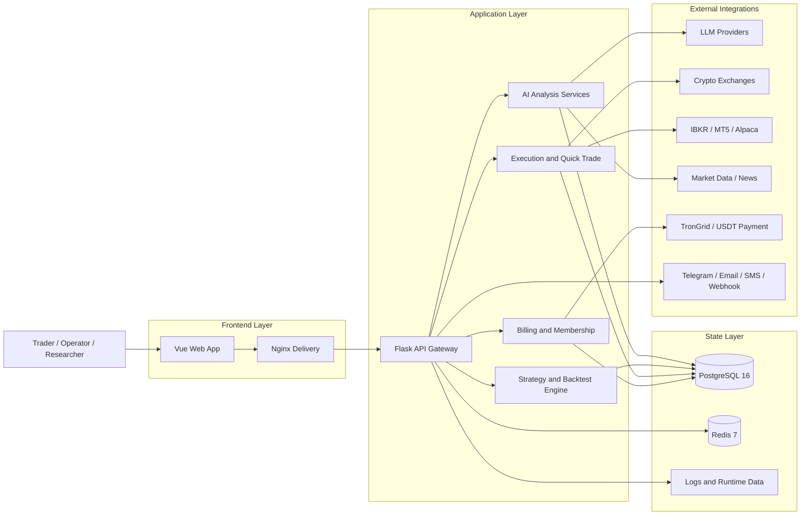

<div align="center">
  <a href="https://github.com/brokermr810/QuantDinger">
    
  </a>

  <h1>QuantDinger</h1>
  <h3>Your Private AI Quant Operating System</h3>
  <p><strong>One Docker stack for charting, multi-LLM research, Python strategies, institutional-grade backtests, and multi-venue live execution — fully self-hosted, your keys, your data.</strong></p>
  <p><em>Open-source quant OS: AI-assisted coding → backtest → paper → live on crypto, IBKR, MT5 &amp; Alpaca — with Agent Gateway, MCP tools, and optional multi-tenant billing.</em></p>

  <div align="center" style="max-width: 680px; margin: 1.25rem auto 0; padding: 20px 22px 22px; border: 1px solid #d1d9e0; border-radius: 16px;">
    <p style="margin: 0 0 14px; line-height: 1.65;">
      <a href="README.md"><strong>English</strong></a>
      <span style="color: #afb8c1;"> · </span>
      <a href="docs/README_CN.md"><strong>简体中文</strong></a>
      <span style="color: #afb8c1;"> · </span>
      <a href="docs/README_JA.md"><strong>日本語</strong></a>
      <span style="color: #afb8c1;"> · </span>
      <a href="docs/README_KO.md"><strong>한국어</strong></a>
      <span style="color: #afb8c1;"> · </span>
      <a href="docs/README_TH.md"><strong>ไทย</strong></a>
      <span style="color: #afb8c1;"> · </span>
      <a href="docs/README_VI.md"><strong>Tiếng Việt</strong></a>
      <span style="color: #afb8c1;"> · </span>
      <a href="docs/README_AR.md"><strong>العربية</strong></a>
    </p>
    <p style="margin: 0 0 18px; padding-bottom: 16px; border-bottom: 1px solid #eaeef2; line-height: 2;">
      <a href="https://ai.quantdinger.com"><strong>SaaS</strong></a>
      <span style="color: #d8dee4;"> &nbsp;·&nbsp; </span>
      <a href="https://www.youtube.com/watch?v=tNAZ9uMiUUw"><strong>Video Demo</strong></a>
      <span style="color: #d8dee4;"> &nbsp;·&nbsp; </span>
      <a href="https://www.quantdinger.com"><strong>Website</strong></a>
      <span style="color: #d8dee4;"> &nbsp;·&nbsp; </span>
      <a href="https://aws.amazon.com/marketplace/pp/prodview-naanrb7d2mbc6"><strong>AWS Marketplace</strong></a>
    </p>
    <p style="margin: 0; line-height: 2;">
      <a href="https://t.me/quantdinger"></a>
      &nbsp;
      <a href="https://discord.com/invite/tyx5B6TChr"></a>
      &nbsp;
      <a href="https://youtube.com/@quantdinger"></a>
      &nbsp;
      <a href="https://x.com/QuantDinger_EN"></a>
    </p>
  </div>

  <p style="margin-top: 1.45rem; margin-bottom: 10px;">
    <a href="LICENSE"></a>
    
    
    
    
    
    
    
  </p>
  <p style="margin: 10px 0 12px;">
    <a href="https://aws.amazon.com/marketplace/pp/prodview-naanrb7d2mbc6"></a>
  </p>
  <p style="margin: 12px 0 10px;">
    <a href="https://oosmetrics.com/repo/brokermr810/QuantDinger"></a>
  </p>
  <p style="margin-top: 14px;">
    <a href="https://www.producthunt.com/products/quantdinger/launches/quantdinger?embed=true&amp;utm_source=badge-featured&amp;utm_medium=badge&amp;utm_campaign=badge-quantdinger" target="_blank" rel="noopener noreferrer"></a>
  </p>
</div>

---

## Contents

[Quick start](#try-in-2-minutes) · [Technical highlights](#technical-highlights) · [Repositories](#related-repositories) · [AI agents & MCP](#use-it-from-an-ai-agent-cursor--claude-code--codex--mcp) · [Overview](#product-overview) · [Features](#features-at-a-glance) · [Visual tour](#visual-tour) · [Architecture](#architecture) · [Install](#installation--first-time-setup-docker-compose) · [Docs](#documentation) · [FAQ](#faq) · [License](#license-and-commercial-terms)

---

> QuantDinger is a **self-hosted, local-first** quantitative OS — not a chatbot with a buy button. It unifies **multi-LLM research**, **Python-native strategy engines**, **server-side backtesting**, and **multi-broker live execution** (10+ crypto venues, IBKR, MT5, Alpaca) in one production-grade stack you fully control.

<div align="center">
  
  <p><sub><em>From zero to running stack — charting, AI research, and strategy workflow in minutes.</em></sub></p>
</div>

<div align="center">
  
  <p><sub><em>Five-layer quant engine on a closed loop: <strong>Idea → Indicator → Strategy → Backtest → Optimize → Execute → Monitor</strong> — market data in, audited orders out.</em></sub></p>
</div>

## Technical highlights

| | What makes QuantDinger different |
|---|----------------------------------|
| **Full-stack quant OS** | Charting, indicator IDE, AI research, backtests, live bots, quick trade, and broker account management — one product, one Postgres state store. |
| **Agent-native** | First-class **Agent Gateway** (`/api/agent/v1`) + **[`quantdinger-mcp`](https://pypi.org/project/quantdinger-mcp/)** on PyPI — Cursor, Claude Code, and Codex can read markets, run backtests, and trade (paper by default) with full audit logs. |
| **Dual strategy runtimes** | **`IndicatorStrategy`** (vectorized dataframe signals + chart overlays) and **`ScriptStrategy`** (event-driven `on_bar`, explicit orders) — research and production in the same codebase. |
| **Multi-venue execution** | CCXT crypto (Binance, OKX, Bybit, …), **IBKR** stocks, **MT5** forex, **Alpaca** US equities/ETFs/crypto — unified Broker Accounts page with isolated multi-tenant sessions. |
| **Production-grade infra** | **PostgreSQL 16** + **Redis 7**, connection pooling, background workers (orders, portfolio monitor, reflection), idempotent schema bootstrap, GHCR multi-arch images (amd64/arm64). |
| **Security by default** | Refuses default `SECRET_KEY`, agent tokens hashed at rest, **paper-only trading** unless explicitly unlocked server-side, every agent call audit-logged. |
| **Operator-ready** | OAuth, multi-user roles, credits/membership/USDT billing toggles, AWS Marketplace AMI, 7-language docs — build a commercial quant product on top, not just a hobby bot. |

## Try in 2 minutes

> **Fastest path: one command.** No `git clone`, no `npm`, no Vue source tree. Prebuilt images from GHCR; `SECRET_KEY` auto-generated on first backend start.

**Prerequisites:** [Docker](https://docs.docker.com/get-docker/) with Compose v2 (Docker Desktop on Windows/macOS). **Node.js is not required.**

### One-line install (Linux / macOS)

```bash
curl -fsSL https://raw.githubusercontent.com/brokermr810/QuantDinger/main/install.sh | bash
```

Installs to `~/quantdinger` by default (override: `… | bash -s -- /opt/quantdinger`). Re-run the same command to pull latest images and restart.

Then open **`http://localhost:8888`**, sign in with **`quantdinger` / `123456`**, and **change the default admin password**.

### Lightest: two files only (no `git clone`)

If you only need a running stack and can reach GHCR + Docker Hub (or a mirror):

```bash
curl -O https://raw.githubusercontent.com/brokermr810/QuantDinger/main/docker-compose.ghcr.yml
curl -o backend.env https://raw.githubusercontent.com/brokermr810/QuantDinger/main/backend_api_python/env.example
docker compose -f docker-compose.ghcr.yml pull
docker compose -f docker-compose.ghcr.yml up -d
```

`SECRET_KEY` is auto-generated on first backend start. Open **`http://localhost:8888`**.

### Standard: clone this repo (recommended for config & docs)

**macOS / Linux (Bash) — one line**

```bash
git clone https://github.com/brokermr810/QuantDinger.git && cd QuantDinger && cp backend_api_python/env.example backend_api_python/.env && chmod +x scripts/generate-secret-key.sh && ./scripts/generate-secret-key.sh && docker compose pull && docker compose up -d
```

**Windows (PowerShell)** — folder name after clone is **`QuantDinger`** (same spelling as the GitHub repo; `cd quantdinger` also works on Windows when case-insensitive):

```powershell
git clone https://github.com/brokermr810/QuantDinger.git
Set-Location QuantDinger
Copy-Item backend_api_python\env.example -Destination backend_api_python\.env
$key = & python -c "import secrets; print(secrets.token_hex(32))" 2>$null
if (-not $key) { $key = & py -c "import secrets; print(secrets.token_hex(32))" 2>$null }
if (-not $key) { $key = & python3 -c "import secrets; print(secrets.token_hex(32))" 2>$null }
if (-not $key) { Write-Error "Install Python 3 from python.org (tick 'Add to PATH') or use Git Bash with the Bash one-liner above." }
(Get-Content backend_api_python\.env) -replace '^SECRET_KEY=.*$', "SECRET_KEY=$key" | Set-Content backend_api_python\.env -Encoding utf8
docker compose pull
docker compose up -d
```

Use **`docker compose`** (space). Legacy **`docker-compose`** (hyphen) works on many installs. **Git Bash** can run the Bash one-liner as-is.

<details>
<summary><b>Do not use <code>docker compose up --build</code> for a normal install</b></summary>

A plain `docker compose up --build` does **not** rebuild the frontend — the main `docker-compose.yml` only declares `image:` for the frontend service, so `--build` only affects the backend. To rebuild the frontend from local Vue source you must opt in via the `docker-compose.build.yml` override (see below).

| Goal | Command |
|------|---------|
| First-time / routine start | `docker compose pull` then `docker compose up -d` |
| Rebuild **backend** only after code changes | `docker compose up -d --build backend` |
| Hack on Vue UI from source | Clone [QuantDinger-Vue](https://github.com/brokermr810/QuantDinger-Vue) into `./QuantDinger-Vue/`, then `docker compose -f docker-compose.yml -f docker-compose.build.yml up -d --build` |

</details>

<details>
<summary><b>Slow or failed <code>docker pull</code> (China / VPN)</b></summary>

System VPN often **does not** proxy Docker Desktop. Either configure **Docker Desktop → Settings → Proxies** (e.g. `http://127.0.0.1:7890` for Clash), or add to a **repository-root** `.env`:

```ini
IMAGE_PREFIX=docker.m.daocloud.io/library/
```

Then run `docker compose pull` again. Errors like `content size of zero` or `connectex` on `registry-1.docker.io` are registry/network issues, not application bugs.

</details>

---

Then open **`http://localhost:8888`**, sign in with **`quantdinger` / `123456`**, and **change the default admin password** before any real use.

For step-by-step detail and troubleshooting, see **[Installation & first-time setup](#installation--first-time-setup-docker-compose)**.

## Related repositories

This repo ships the **backend**, **Docker Compose** stack, and **documentation**. The web UI image is published independently to GHCR by the sibling Vue repo. Use the sibling repos when you need source-level UI changes or the mobile app:

| Repository | What it is |
|------------|------------|
| **[QuantDinger](https://github.com/brokermr810/QuantDinger)** (this repo) | Backend (Flask/Python), Compose stack, docs |
| **[QuantDinger-Vue](https://github.com/brokermr810/QuantDinger-Vue)** | **Web frontend source** (Vue) — tagging `v*` publishes `ghcr.io/brokermr810/quantdinger-frontend` automatically |
| **[QuantDinger-Mobile](https://github.com/brokermr810/QuantDinger-Mobile)** | **Open-source mobile client** — pairs with your self-hosted or SaaS backend |

**Note:** Node.js is only required if you build the web UI from **QuantDinger-Vue**; the default Docker quick start pulls the published image and does not need it.

## Use it from an AI agent (Cursor / Claude Code / Codex / MCP)

QuantDinger ships an **Agent Gateway** at `/api/agent/v1` plus a small **MCP server** ([`quantdinger-mcp`](https://pypi.org/project/quantdinger-mcp/) on PyPI) that wraps it as Model Context Protocol tools. Issue a token once and your AI client can read markets, manage strategies, run backtests, and (paper-only by default) place trades — without ever seeing your exchange keys or your admin JWT.

> Every agent call is **audit-logged**, and trading-class tokens are **paper-only by default**. Live execution requires both `paper_only=false` on the token AND `AGENT_LIVE_TRADING_ENABLED=true` on the server.

**Two backends, same client config — only `QUANTDINGER_BASE_URL` differs:**

- **Hosted (30 s try-out)** — sign up at [ai.quantdinger.com](https://ai.quantdinger.com) → **Sidebar → Agent Tokens** → Issue Token. Locked to `paper_only=true`, no real-money orders.
- **Self-hosted (this repo)** — after the [Try in 2 minutes](#try-in-2-minutes) Docker bring-up, open `http://localhost:8888/#/agent-tokens`. You control scopes, allowlists, rate limits, and live-trading flag.

Then point Cursor / Claude Code / Codex at the MCP server (`.cursor/mcp.json` template: [`docs/agent/cursor-mcp.example.json`](docs/agent/cursor-mcp.example.json)):

```json
{ "mcpServers": { "quantdinger": {
  "command": "uvx", "args": ["quantdinger-mcp"],
  "env": { "QUANTDINGER_BASE_URL": "http://localhost:8888",
           "QUANTDINGER_AGENT_TOKEN": "qd_agent_xxxxxxxx" }
} } }
```

**Full setup recipe** — local stdio config, remote HTTP transport, Claude Code CLI helper, example agent prompts, audit-log walkthrough: **[`docs/agent/MCP_SETUP.md`](docs/agent/MCP_SETUP.md)**.

Deeper references: [AI Integration design](docs/agent/AI_INTEGRATION_DESIGN.md) · [Quickstart with `curl`](docs/agent/AGENT_QUICKSTART.md) · [OpenAPI 3.0 spec](docs/agent/agent-openapi.json) · [MCP server README](mcp_server/README.md)

## Product overview

QuantDinger is a **self-hosted quantitative operating system** — not a single-purpose trading bot. It replaces the typical patchwork of TradingView + Jupyter + ChatGPT + exchange scripts with **one audited, Docker-native stack**: multi-LLM research, Python strategy IDEs, server-side backtests, and live execution across crypto, equities, forex, and ETFs — with optional multi-user billing for operators who resell access.

| Typical DIY stack | QuantDinger |
|-------------------|-------------|
| Chat AI disconnected from execution | Research, NL→code, backtests, and orders in one product with shared Postgres state |
| 5–10 tools wired by hand | Nginx + Vue UI, Flask API, Redis-backed workers, env-driven exchange/LLM adapters |
| Opaque SaaS holds your keys | Your infra, your exchange keys, your LLM keys — Apache 2.0 backend |
| Script bots with no audit trail | Agent Gateway with scope limits, rate limits, and append-only audit log |
| Research code ≠ live code | `IndicatorStrategy` and `ScriptStrategy` share the same runtime and data layer |

**Audience:** independent quants, Python strategy authors, prop/small teams, and operators building white-label quant products on private infrastructure.

## Visual Tour

<table align="center" width="100%">
  <tr>
    <td colspan="2" align="center">
      <a href="https://www.youtube.com/watch?v=wHIvvv6fmHA">
        
      </a>
      <br/>
      <sub>
        <a href="https://www.youtube.com/watch?v=wHIvvv6fmHA">
          <strong>▶ Watch Product Demo on YouTube</strong>
        </a>
      </sub>
      <br/>
      <sub>Click the preview card above to open the full video walkthrough.</sub>
    </td>
  </tr>
  <tr>
    <td width="50%" align="center"><br/><sub>Indicator IDE, charting, backtest, and quick trade</sub></td>
    <td width="50%" align="center"><br/><sub>AI asset analysis and opportunity radar</sub></td>
  </tr>
  <tr>
    <td align="center"><br/><sub>Trading bot workspace and automation templates</sub></td>
    <td align="center"><br/><sub>Strategy live operations, performance, and monitoring</sub></td>
  </tr>
</table>

## Features at a glance

- **Research & AI** — Multi-LLM ensemble analysis, watchlists, opportunity radar, NL→indicator/strategy, post-backtest AI hints; optional confidence calibration. **[Agent Gateway + MCP](#use-it-from-an-ai-agent-cursor--claude-code--codex--mcp)** for Cursor / Claude Code / Codex with scoped tokens and SSE job streaming.
- **Build** — Professional KLine chart UI; `IndicatorStrategy` (dataframe `buy`/`sell` signals) and `ScriptStrategy` (`on_bar`, `ctx.buy()` / `ctx.sell()`); AI code generation as a starting point, Python as source of truth.
- **Validate** — Server-side backtests with equity curves, drawdown metrics, trade logs, and strategy snapshots — no client-side-only backtest theater.
- **Operate** — Live strategy bots, quick trade, **10+ crypto exchanges** via CCXT, **IBKR** / **MT5** / **Alpaca** (US stocks, ETFs, crypto); unified **Broker Accounts** page; notifications (Telegram, email, SMS, Discord, webhooks).
- **Platform** — Docker Compose + GHCR images, PostgreSQL 16, Redis 7, OAuth, multi-user RBAC, credits / membership / USDT billing toggles, AWS Marketplace AMI, 7-language documentation.

## Architecture

**Design principle:** separate **market data ingestion**, **strategy/backtest compute**, and **order execution** so research never shares a code path with live capital unless you explicitly promote a strategy.

**Stack:** Nginx serves the prebuilt Vue SPA (`ghcr.io/brokermr810/quantdinger-frontend`); **Flask + Gunicorn** API hosts strategy, AI, billing, and agent services; **PostgreSQL 16** is the system of record; **Redis 7** backs cache and worker coordination. Exchanges, brokers, LLMs, and payment rails plug in through env-driven adapters — swap providers without forking core code.

**Runtime flow:** market feeds → indicator/signal layer → strategy engine → backtest or live runtime → venue-specific execution adapters; pending orders dispatched by background workers with health checks and retry semantics.

**Deploy surfaces:** one-line `install.sh`, zero-repo GHCR Compose, full-repo Compose (local backend build), AWS Marketplace AMI, and SaaS at [ai.quantdinger.com](https://ai.quantdinger.com) for trials.

### System diagram



## Installation & first-time setup (Docker Compose)

> **Already ran [Try in 2 minutes](#try-in-2-minutes)?** Skip this section — it's the same outcome, just expanded into a step-by-step checklist for first-time deployers and operations folks who want to understand every knob.

This section mirrors a typical “local deploy” path: **prepare the host → obtain the code → configure secrets → start the stack → verify → harden → optionally wire AI**. Node.js is **not** required: the `frontend` service pulls `ghcr.io/brokermr810/quantdinger-frontend` directly, so Nginx serves the SPA without any local build step.

### Prerequisites

| Item | Notes |
|------|--------|
| [Docker](https://docs.docker.com/get-docker/) + Docker Compose v2 | Used for Postgres, Redis, API, and static UI. |
| `git` | To clone this repository. |
| Ports (defaults) | `8888` (web), `5000` (API, bound to **127.0.0.1**), `5433` / `6379` (DB/Redis on loopback; Postgres host port avoids common `5432` conflicts). Change via root `.env` if they collide. |
| Disk | Postgres volume grows with users, strategies, and logs; plan a few GB minimum for serious use. |

### 1) Clone the repository

```bash
git clone https://github.com/brokermr810/QuantDinger.git
cd QuantDinger
```

### 2) Create backend configuration (mandatory)

```bash
cp backend_api_python/env.example backend_api_python/.env
```

Almost all runtime behavior is driven by **`backend_api_python/.env`** (database URL, admin user, LLM keys, workers, billing toggles, etc.). The optional **repository root** `.env` only adjusts Compose-level concerns such as **ports** and **image mirrors** (`IMAGE_PREFIX`).

### 3) Set `SECRET_KEY` before the first boot (mandatory)

The API **refuses to start** if `SECRET_KEY` is still the placeholder from `env.example`. This blocks accidental insecure deployments.

**Linux / macOS** (recommended):

```bash
./scripts/generate-secret-key.sh
```

The script overwrites the `SECRET_KEY=` line in `backend_api_python/.env` using Python’s `secrets` module.

**Manual** (any OS): generate a long random string (for example 64 hex chars) and set `SECRET_KEY=...` in `backend_api_python/.env`.

### 4) Start the stack

```bash
docker compose pull
docker compose up -d
```

- **`frontend`** — pulls `ghcr.io/brokermr810/quantdinger-frontend:latest` (no local Vue tree required).
- **`backend`** — built from `./backend_api_python` on first start if no local image exists yet.
- For UI development from Vue source, clone **QuantDinger-Vue** into `./QuantDinger-Vue/` and add `-f docker-compose.build.yml` to the command (see *Build the frontend from Vue source* below).

Services: **`postgres`**, **`redis`**, **`backend`**, **`frontend`** (see `docker-compose.yml`).

#### Alternative: zero-repo install from GHCR (lightest)

Prebuilt multi-arch (amd64/arm64) images for **both** backend and frontend — no `git clone`:

```bash
curl -O https://raw.githubusercontent.com/brokermr810/QuantDinger/main/docker-compose.ghcr.yml
curl -o backend.env https://raw.githubusercontent.com/brokermr810/QuantDinger/main/backend_api_python/env.example
docker compose -f docker-compose.ghcr.yml pull
docker compose -f docker-compose.ghcr.yml up -d
```

The backend entrypoint auto-generates a random `SECRET_KEY` on first start and applies the schema (`migrations/init.sql`) idempotently. Edit `backend.env` for persistent overrides (API keys, OAuth, broker credentials). Compose orchestration knobs go in a separate `.env` (optional) — e.g. pin a version:

```env
# Common case: lockstep both sides to one tag
IMAGE_TAG=3.0.10

# Advanced (opt-in): decouple sides. Either var alone overrides only
# that side; the other still follows IMAGE_TAG.
# BACKEND_TAG=v3.0.9
# FRONTEND_TAG=v3.1.0-rc1

# BACKEND_IMAGE=ghcr.io/<your-fork>/quantdinger-backend     # optional, for forks
# FRONTEND_IMAGE=ghcr.io/<your-fork>/quantdinger-frontend
```

Tag resolution: `BACKEND_TAG` / `FRONTEND_TAG` → `IMAGE_TAG` → compose default (`latest`). Without a root `.env`, both compose files pull `ghcr.io/brokermr810/quantdinger-{backend,frontend}:latest`. Pin a specific release by setting `IMAGE_TAG` (lockstep) or `BACKEND_TAG` / `FRONTEND_TAG` (per-side) — see [GitHub Releases](https://github.com/brokermr810/QuantDinger/releases) for available tags.

#### Alternative: build the frontend from Vue source

If you have access to the **QuantDinger-Vue** repo and want to iterate on UI source (theme tweaks, forks, debugging) instead of pulling the published image, clone it into the `./QuantDinger-Vue/` slot at the repo root (gitignored) and let Compose build from there:

```bash
git clone https://github.com/brokermr810/QuantDinger-Vue.git QuantDinger-Vue
docker compose -f docker-compose.yml -f docker-compose.build.yml up -d --build
```

The main `docker-compose.yml` only pulls the GHCR image; the override file `docker-compose.build.yml` adds the local `build:` block. Without the override, `./QuantDinger-Vue/` does not need to exist. Point `FRONTEND_SRC_PATH=/abs/path/to/QuantDinger-Vue` if you'd rather keep the source somewhere else, or set `COMPOSE_FILE=docker-compose.yml:docker-compose.build.yml` in a root `.env` to skip the long `-f -f` invocation. The locally built image is tagged the same way as the published one (`FRONTEND_TAG` / `IMAGE_TAG` rules apply), so it slots into the rest of the stack with no further changes.

### 5) Verify and sign in

| Check | URL / command |
|--------|----------------|
| Web UI | `http://localhost:8888` (override host/port with `FRONTEND_HOST` / `FRONTEND_PORT` in root `.env` if needed). |
| API health | `http://localhost:5000/api/health` |
| Logs | `docker-compose logs -f backend` |

Default admin (change immediately in production):

- **User**: `quantdinger`
- **Password**: `123456` (from `env.example`; override with `ADMIN_USER` / `ADMIN_PASSWORD` in `.env` before first use if you prefer).

Also set **`FRONTEND_URL`** in `backend_api_python/.env` to the URL users actually use (including `https://` behind a reverse proxy); it affects redirects, CORS-related settings, and some generated links.

### 6) Optional: enable AI features

AI analysis, NL→code, and related flows need at least one LLM provider configured. Open `backend_api_python/env.example`, find the **AI / LLM** block, copy the relevant keys into your `.env` (for example `LLM_PROVIDER` + `OPENROUTER_API_KEY`, or another supported provider). Restart the backend after edits.

### 7) Windows notes

Use **Docker Desktop** (WSL2 backend recommended). From PowerShell in the repo root:

```powershell
git clone https://github.com/brokermr810/QuantDinger.git
Set-Location QuantDinger
Copy-Item backend_api_python\env.example -Destination backend_api_python\.env
$key = py -c "import secrets; print(secrets.token_hex(32))"
(Get-Content backend_api_python\.env) -replace '^SECRET_KEY=.*$', "SECRET_KEY=$key" | Set-Content backend_api_python\.env -Encoding UTF8
docker compose pull
docker compose up -d
```

If `py` is not on PATH, use `python` or `python3` in the one-liner that generates `$key`. Line endings should remain UTF-8; avoid editors that strip newlines from `.env`.

### Troubleshooting (first boot)

| Symptom | What to check |
|---------|----------------|
| `QuantDinger-Vue` not found | You added `-f docker-compose.build.yml` without cloning Vue source. Drop the override (plain `docker compose up -d`) or clone into `./QuantDinger-Vue/` first. |
| `redis` / `python` / `node` pull fails, `content size of zero` | Docker Hub unreachable from Docker Desktop. Set root `.env` `IMAGE_PREFIX=docker.m.daocloud.io/library/` and/or configure **Docker Desktop → Proxies** (system VPN alone is often not enough). |
| Backend exits immediately | `SECRET_KEY` still default, or invalid `.env` syntax. Read `docker compose logs backend`. |
| Blank page or API errors from browser | `FRONTEND_URL` / origins mismatch; API not reachable from the host you opened. |
| Port already in use | Another Postgres, Redis, or local service on `5433` / `6379` / `5000` / `8888` (Postgres defaults to host `5433` to avoid local `5432`). Set `DB_PORT`, `REDIS_PORT`, etc. in root `.env` per `docker-compose.yml`. |
| Many live strategies, “start denied” | Raise `STRATEGY_MAX_THREADS` in `backend_api_python/.env` and restart API (see comments in `env.example`). |

### Common Docker commands

```bash
docker compose ps
docker compose logs -f backend
docker compose restart backend
docker compose pull
docker compose up -d
docker compose up -d --build backend   # backend code changes only
docker compose down
```

### Optional root `.env` (Compose only)

For **custom ports** or **mirror/prefix** for base images (slow Docker Hub pulls), create a file named `.env` in the **repository root** (same directory as `docker-compose.yml`):

```ini
FRONTEND_PORT=3000
BACKEND_PORT=127.0.0.1:5001
IMAGE_PREFIX=docker.m.daocloud.io/library/
```

Production-style TLS, domain, and reverse-proxy placement are covered in **[Cloud deployment](docs/CLOUD_DEPLOYMENT_EN.md)**.

### Suggested first session (product walkthrough)

After the stack is healthy: (1) run an **AI asset / market analysis** so LLM and data paths are verified; (2) open the **Indicator IDE**, load a symbol, and run a **signal backtest** on a small date range; (3) optionally use **AI code generation** to draft an indicator, then edit the Python; (4) when ready, attach **exchange API keys** (profile / credentials), use **test connection**, then explore **live strategy** or **quick trade** with execution mode you intend. This order surfaces configuration issues early before real capital.

## Minimal Example: Python Indicator Strategy

This is the kind of Python-native strategy logic QuantDinger is designed for:

```python
# @param sma_short int 14 Short moving average
# @param sma_long int 28 Long moving average

sma_short_period = params.get('sma_short', 14)
sma_long_period = params.get('sma_long', 28)

my_indicator_name = "Dual Moving Average Strategy"
my_indicator_description = f"SMA {sma_short_period}/{sma_long_period} crossover"

df = df.copy()
sma_short = df["close"].rolling(sma_short_period).mean()
sma_long = df["close"].rolling(sma_long_period).mean()

buy = (sma_short > sma_long) & (sma_short.shift(1) <= sma_long.shift(1))
sell = (sma_short < sma_long) & (sma_short.shift(1) >= sma_long.shift(1))

df["buy"] = buy.fillna(False).astype(bool)
df["sell"] = sell.fillna(False).astype(bool)
```

See full examples:

- [`docs/examples/dual_ma_with_params.py`](docs/examples/dual_ma_with_params.py)
- [`docs/examples/multi_indicator_composite.py`](docs/examples/multi_indicator_composite.py)
- [`docs/examples/cross_sectional_momentum_rsi.py`](docs/examples/cross_sectional_momentum_rsi.py)

## Supported Markets, Brokers, and Exchanges

### Crypto Exchanges

| Venue | Coverage |
|-------|----------|
| Binance | Spot, Futures, Margin |
| OKX | Spot, Perpetual, Options |
| Bitget | Spot, Futures, Copy Trading |
| Bybit | Spot, Linear Futures |
| Coinbase | Spot |
| Kraken | Spot, Futures |
| KuCoin | Spot, Futures |
| Gate.io | Spot, Futures |
| Deepcoin | Derivatives integration |
| HTX | Spot, USDT-margined perpetuals |

### Traditional Markets

| Market | Broker / Source | Execution |
|--------|------------------|-----------|
| US Stocks | IBKR, Alpaca, Yahoo Finance, Finnhub | Via IBKR or Alpaca (paper + live) |
| ETFs | Alpaca | Via Alpaca (paper + live) |
| Forex | MT5, OANDA | Via MT5 |
| Futures | Exchange and data integrations | Data and workflow support |

> **Broker Accounts page (`/broker-accounts`, v3.0.5+)** — IBKR, MT5 and Alpaca share a single unified management page: per-broker connect form, account KPIs, positions table and open-order management with one-click cancel. Multi-tenant safe: each user's session is isolated via `BrokerSessionRegistry`, so one user reconnecting doesn't kick everyone else off.

## Strategy Development Modes

QuantDinger supports two main strategy authoring models:

### IndicatorStrategy

- dataframe-based Python scripts
- `buy` / `sell` signal generation
- chart rendering and signal-style backtests
- best for research, indicator logic, and visual strategy prototyping

### ScriptStrategy

- event-driven `on_init(ctx)` / `on_bar(ctx, bar)` scripts
- explicit runtime control with `ctx.buy()`, `ctx.sell()`, `ctx.close_position()`
- best for stateful strategies, execution-oriented logic, and live alignment

For the full developer workflow, see:

- [Strategy Development Guide](docs/STRATEGY_DEV_GUIDE.md)
- [Cross-Sectional Strategy Guide](docs/CROSS_SECTIONAL_STRATEGY_GUIDE_EN.md)
- [Strategy Examples](docs/examples/)

The example scripts live in `docs/examples/` and are kept aligned with the current strategy development guides.

## Repository Layout

```text
QuantDinger/
├── backend_api_python/      # Open backend source code
│   ├── app/routes/          # REST endpoints
│   ├── app/services/        # AI, trading, billing, backtest, integrations
│   ├── migrations/init.sql  # Database initialization
│   ├── env.example          # Main environment template
│   └── Dockerfile
├── docs/                    # Product, strategy, and deployment documentation
├── install.sh               # One-line GHCR install (curl | bash)
├── docker-compose.yml       # Web UI via GHCR; optional ./QuantDinger-Vue/ for local UI builds
├── docker-compose.ghcr.yml  # Zero-repo deploy — both images from GHCR
├── LICENSE
└── TRADEMARKS.md
```

## Configuration Areas

Use `backend_api_python/env.example` as the primary template. Key areas include:

| Area | Examples |
|------|----------|
| Authentication | `SECRET_KEY`, `ADMIN_USER`, `ADMIN_PASSWORD` |
| Database | `DATABASE_URL` |
| LLM / AI | `LLM_PROVIDER`, `OPENROUTER_API_KEY`, `OPENAI_API_KEY` |
| OAuth | `GOOGLE_CLIENT_ID`, `GITHUB_CLIENT_ID` |
| Security | `TURNSTILE_SITE_KEY`, `ENABLE_REGISTRATION` |
| Billing | `BILLING_ENABLED`, `BILLING_COST_AI_ANALYSIS` |
| Membership | `MEMBERSHIP_MONTHLY_PRICE_USD`, `MEMBERSHIP_MONTHLY_CREDITS` |
| USDT Payment | `USDT_PAY_ENABLED`, `USDT_TRC20_XPUB`, `TRONGRID_API_KEY` |
| Optional data APIs | `TWELVE_DATA_API_KEY`, `FINNHUB_API_KEY`, `TIINGO_API_KEY`, `ADANOS_API_KEY` |
| Proxy | `PROXY_URL` |
| Workers | `ENABLE_PENDING_ORDER_WORKER`, `ENABLE_PORTFOLIO_MONITOR`, `ENABLE_REFLECTION_WORKER` |
| AI tuning | `ENABLE_AI_ENSEMBLE`, `ENABLE_CONFIDENCE_CALIBRATION`, `AI_ENSEMBLE_MODELS` |

## Documentation

| Doc | Notes |
|-----|--------|
| [Changelog](docs/CHANGELOG.md) | Releases & migrations |
| [README (中文)](docs/README_CN.md) | Chinese overview |
| [JA](docs/README_JA.md) · [KO](docs/README_KO.md) · [TH](docs/README_TH.md) · [VI](docs/README_VI.md) · [AR](docs/README_AR.md) | Concise localized READMEs (Japanese, Korean, Thai, Vietnamese, Arabic) |
| [Cloud deployment](docs/CLOUD_DEPLOYMENT_EN.md) | HTTPS, reverse proxy, production |
| [Multi-user](docs/multi-user-setup.md) | Postgres multi-tenant patterns |
| [Agent environment](docs/agent/AGENT_ENVIRONMENT_DESIGN.md) · [AI integration](docs/agent/AI_INTEGRATION_DESIGN.md) · [Quickstart](docs/agent/AGENT_QUICKSTART.md) · [OpenAPI](docs/agent/agent-openapi.json) · [MCP server](mcp_server/README.md) | Coding agents & MCP (`quantdinger-mcp` on PyPI) |

**Strategy:** [EN](docs/STRATEGY_DEV_GUIDE.md) · [CN](docs/STRATEGY_DEV_GUIDE_CN.md) · [TW](docs/STRATEGY_DEV_GUIDE_TW.md) · [JA](docs/STRATEGY_DEV_GUIDE_JA.md) · [KO](docs/STRATEGY_DEV_GUIDE_KO.md) · [Cross-sectional EN](docs/CROSS_SECTIONAL_STRATEGY_GUIDE_EN.md) / [CN](docs/CROSS_SECTIONAL_STRATEGY_GUIDE_CN.md) · [Examples](docs/examples/)

**Integrations & alerts:** [IBKR](docs/IBKR_TRADING_GUIDE_EN.md) · [MT5 EN](docs/MT5_TRADING_GUIDE_EN.md) / [CN](docs/MT5_TRADING_GUIDE_CN.md) · [OAuth EN](docs/OAUTH_CONFIG_EN.md) / [CN](docs/OAUTH_CONFIG_CN.md) · Telegram / Email / SMS configs under [`docs/`](docs/) (`NOTIFICATION_*`).

## FAQ

### Is QuantDinger really self-hosted?

Yes. The default deployment model is your own Docker Compose stack with your own database, Redis instance, credentials, and environment configuration.

### Is QuantDinger only for crypto trading?

No. Crypto is a major focus, but the platform also includes IBKR and Alpaca workflows for US stocks / ETFs (Alpaca additionally covers crypto) and MT5 workflows for forex.

### Can I write strategies directly in Python?

Yes. QuantDinger supports both dataframe-style `IndicatorStrategy` development and event-driven `ScriptStrategy` development. You can also use AI to generate a starting point and then edit it yourself.

### Is this a research tool or a live trading platform?

It is both. QuantDinger is built to connect AI research, charting, strategy development, backtesting, quick trade flows, and live execution operations in one system.

### Can I use QuantDinger commercially?

The backend is licensed under Apache 2.0. The **web** frontend source ([QuantDinger-Vue](https://github.com/brokermr810/QuantDinger-Vue)) uses a separate source-available license—review both and contact the project for commercial frontend authorization if needed. The **[mobile app repo](https://github.com/brokermr810/QuantDinger-Mobile)** is open source under its own license (see that repository).

### Is there a mobile app?

Yes—see **[QuantDinger-Mobile](https://github.com/brokermr810/QuantDinger-Mobile)** (open source). It connects to the same backend you self-host or to SaaS.

## Exchange Partner Links

The following links are available in-app under **Profile → Open account** or **Broker Accounts → Open account**, and may qualify users for trading-fee rebates depending on venue policies.

### Crypto exchanges (API keys)

| Exchange | Signup Link |
|----------|-------------|
| Binance | [Register](https://www.bsmkweb.cc/register?ref=QUANTDINGER) |
| Bitget | [Register](https://partner.hdmune.cn/bg/7r4xz8kd) |
| Bybit | [Register](https://partner.bybit.com/b/DINGER) |
| OKX | [Register](https://www.xqmnobxky.com/join/QUANTDINGER) |
| Gate.io | [Register](https://www.gateport.business/share/DINGER) |
| HTX | [Register](https://www.htx.com/invite/zh-cn/1f?invite_code=dinger) |

### Forex / CFD — TMGM (MetaTrader 5)

| Broker | Signup Link |
|--------|-------------|
| TMGM (MT5) | [Register](https://portal.tmgm.com/register?node=MTM0Mzc5&language=en) |

After opening a TMGM account, install MetaTrader 5 and bind your server/login under **Profile → Exchange** or **Broker Accounts**.

## License and Commercial Terms

- Backend source code is licensed under **Apache License 2.0**. See `LICENSE`.
- This repository distributes the frontend UI here as **prebuilt files** for integrated deployment.
- The frontend source code is available separately at [QuantDinger Frontend](https://github.com/brokermr810/QuantDinger-Vue) under the **QuantDinger Frontend Source-Available License v1.0**.
- Under that frontend license, non-commercial use and eligible qualified non-profit use are permitted free of charge, while commercial use requires a separate commercial license from the copyright holder.
- Trademark, branding, attribution, and watermark usage are governed separately and may not be removed or altered without permission. See `TRADEMARKS.md`.

For commercial licensing, frontend source access, branding authorization, or deployment support:

- Website: [quantdinger.com](https://quantdinger.com)
- Telegram: [t.me/worldinbroker](https://t.me/worldinbroker)
- Email: [support@quantdinger.com](mailto:support@quantdinger.com)

## Legal Notice and Compliance

QuantDinger is intended for **lawful** research, education, and compliant trading only—not for fraud, market manipulation, sanctions evasion, money laundering, or other illegal activity. Operators must follow applicable laws, licensing, and exchange rules in every jurisdiction where they deploy. **This project does not provide legal, tax, investment, or regulatory advice.** You use the software at your own risk; to the extent permitted by law, contributors disclaim liability for trading losses, service interruption, or regulatory enforcement arising from use or misuse.

## Community and Support

<p>
  <a href="https://t.me/quantdinger"></a>
  <a href="https://discord.com/invite/tyx5B6TChr"></a>
  <a href="https://youtube.com/@quantdinger"></a>
</p>

- [Contributing Guide](CONTRIBUTING.md)
- [Contributors](CONTRIBUTORS.md)
- [Report Bugs / Request Features](https://github.com/brokermr810/QuantDinger/issues)
- Email: [support@quantdinger.com](mailto:support@quantdinger.com)

## Support the Project

Crypto donations:

```text
0x96fa4962181bea077f8c7240efe46afbe73641a7
```

## Star History

[](https://star-history.com/#brokermr810/QuantDinger&Date)

## Acknowledgements

QuantDinger stands on top of a strong open-source ecosystem. Special thanks to projects such as:

- [Flask](https://flask.palletsprojects.com/)
- [Pandas](https://pandas.pydata.org/)
- [CCXT](https://github.com/ccxt/ccxt)
- [yfinance](https://github.com/ranaroussi/yfinance)
- [Vue.js](https://vuejs.org/)
- [Ant Design Vue](https://antdv.com/)
- [KLineCharts](https://github.com/klinecharts/KLineChart)
- [ECharts](https://echarts.apache.org/)
- [Capacitor](https://capacitorjs.com/)
- [bip-utils](https://github.com/ebellocchia/bip_utils)

## P.S. — A Note on the Name

**QuantDinger** is a small tribute to **[Erwin Schrödinger](https://en.wikipedia.org/wiki/Erwin_Schr%C3%B6dinger)** — the "-dinger" in our name is the tail of "Schrödinger". The cat in the box was a thought experiment; every un-fired strategy is its own little version of it — simultaneously winning and losing until the order actually fills. Backtests open the box. Live trading collapses the wavefunction. Trade carefully.

<p align="center"><sub>If QuantDinger is useful to you, a GitHub star helps the project a lot.</sub></p>
